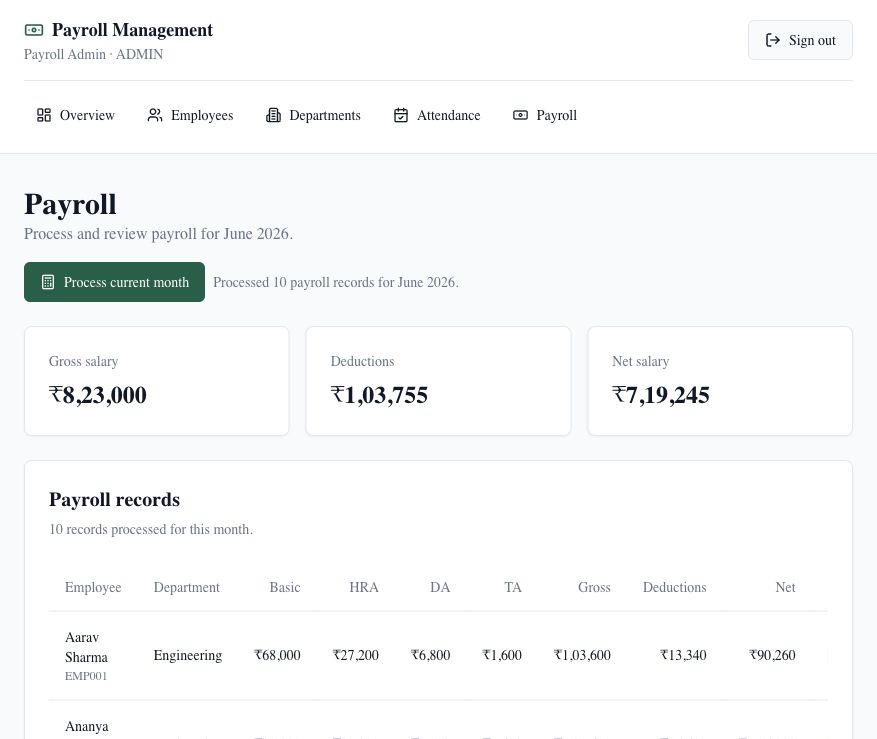

# 💰 Payroll Management System

A full-stack payroll management system built with **Next.js 14**, **Prisma ORM**, **SQLite**, and **NextAuth.js**. Designed for small-to-medium businesses to manage employees, attendance, payroll processing, and payslip generation with role-based access control.

## 📸 Screenshot



## ✨ Features

- 🔐 **Role-Based Authentication** – Separate admin and employee portals with JWT-based session management
- 👥 **Employee Management** – Add, edit, and manage employee records with department assignments
- 🏢 **Department Management** – Organize employees into departments
- 📅 **Attendance Tracking** – Mark and view daily attendance with present/absent status
- 💼 **Payroll Processing** – Automated payroll calculation with HRA, DA, TA allowances and PF, ESI, TDS deductions
- 📄 **Payslip Generation** – Generate and view detailed payslips for each employee per month
- 📊 **Dashboard Analytics** – Visual charts for payroll trends and department distribution
- 👤 **Employee Self-Service Portal** – Employees can view their own payslips and attendance

## 🛠️ Tech Stack

| Layer       | Technology                          |
|-------------|--------------------------------------|
| Framework   | Next.js 14 (App Router)             |
| Language    | TypeScript                           |
| Database    | SQLite via Prisma ORM               |
| Auth        | NextAuth.js v4 (JWT strategy)       |
| UI          | Tailwind CSS + Radix UI             |
| Charts      | Recharts                             |
| Icons       | Lucide React                         |
| Validation  | Zod                                  |

## 📂 Project Structure

```
payroll-management-system/
├── app/
│   ├── api/               # Next.js API routes (auth, employees, payroll, etc.)
│   ├── dashboard/         # Admin dashboard pages
│   │   ├── employees/     # Employee management
│   │   ├── departments/   # Department management
│   │   ├── attendance/    # Attendance management
│   │   ├── payroll/       # Payroll processing
│   │   └── payslips/      # Payslip viewing
│   ├── portal/            # Employee self-service portal
│   ├── login/             # Authentication pages
│   ├── layout.tsx         # Root layout
│   └── globals.css        # Global styles
├── components/
│   ├── dashboard/         # Dashboard-specific components
│   ├── employees/         # Employee form and table components
│   ├── departments/       # Department components
│   ├── attendance/        # Attendance components
│   ├── payroll/           # Payroll components
│   ├── payslips/          # Payslip components
│   ├── portal/            # Employee portal components
│   └── ui/                # Shared UI primitives (shadcn/ui)
├── lib/
│   ├── auth.ts            # NextAuth configuration
│   ├── prisma.ts          # Prisma client singleton
│   ├── payroll-calculator.ts  # Payroll computation logic
│   ├── employees.ts       # Employee data access functions
│   ├── payroll.ts         # Payroll data access functions
│   └── utils.ts           # Utility helpers
├── prisma/
│   ├── schema.prisma      # Database schema
│   └── seed.ts            # Database seeder
├── types/                 # TypeScript type declarations
└── middleware.ts          # Route protection middleware
```

## ⚙️ Payroll Calculation

The system automatically calculates salary components:

**Allowances:**
- HRA (House Rent Allowance) = 40% of Basic Salary
- DA (Dearness Allowance) = 20% of Basic Salary
- TA (Travel Allowance) = 10% of Basic Salary
- **Gross Salary** = Basic + HRA + DA + TA

**Deductions:**
- PF (Provident Fund) = 12% of Basic Salary
- ESI (Employee State Insurance) = 0.75% of Gross Salary
- TDS (Tax Deducted at Source) = 10% of Gross Salary
- **Net Salary** = Gross Salary − Total Deductions

## 🚀 Getting Started

### Prerequisites

- Node.js 18+
- npm or yarn

### Installation

1. **Clone the repository:**
   ```bash
   git clone https://github.com/aryansharma1305/Payroll-Management-system.git
   cd Payroll-Management-system
   ```

2. **Install dependencies:**
   ```bash
   npm install
   ```

3. **Set up environment variables:**
   ```bash
   cp .env.example .env
   ```
   Update `.env` with your values:
   ```env
   DATABASE_URL="file:./dev.db"
   NEXTAUTH_SECRET="your-secret-key-here"
   NEXTAUTH_URL="http://localhost:3000"
   ```

4. **Initialize the database:**
   ```bash
   npm run db:push
   npm run seed
   ```

5. **Start the development server:**
   ```bash
   npm run dev
   ```

6. **Open your browser:** Navigate to [http://localhost:3000](http://localhost:3000)

### Default Credentials

After seeding, you can log in with:

| Role     | Email                  | Password  |
|----------|------------------------|-----------|
| Admin    | admin@company.com      | admin123  |
| Employee | (seeded employee email)| emp123    |

## 🗄️ Database

This project uses SQLite for simplicity. The schema includes:

- `User` – Authentication users with role-based access
- `Department` – Company departments
- `Employee` – Employee records linked to departments
- `Attendance` – Daily attendance entries per employee
- `Payroll` – Monthly payroll records with all salary components

To reset and reseed the database:
```bash
npm run db:push
npm run seed
```

## 📜 Available Scripts

| Script                  | Description                              |
|-------------------------|------------------------------------------|
| `npm run dev`           | Start development server                 |
| `npm run build`         | Build for production                     |
| `npm run start`         | Start production server                  |
| `npm run lint`          | Run ESLint                               |
| `npm run db:push`       | Push Prisma schema to database           |
| `npm run seed`          | Seed the database with sample data       |
| `npm run prisma:generate` | Regenerate Prisma client               |

## 📄 License

This project is open-source and available under the [MIT License](LICENSE).

---

Built with ❤️ using Next.js and Prisma
